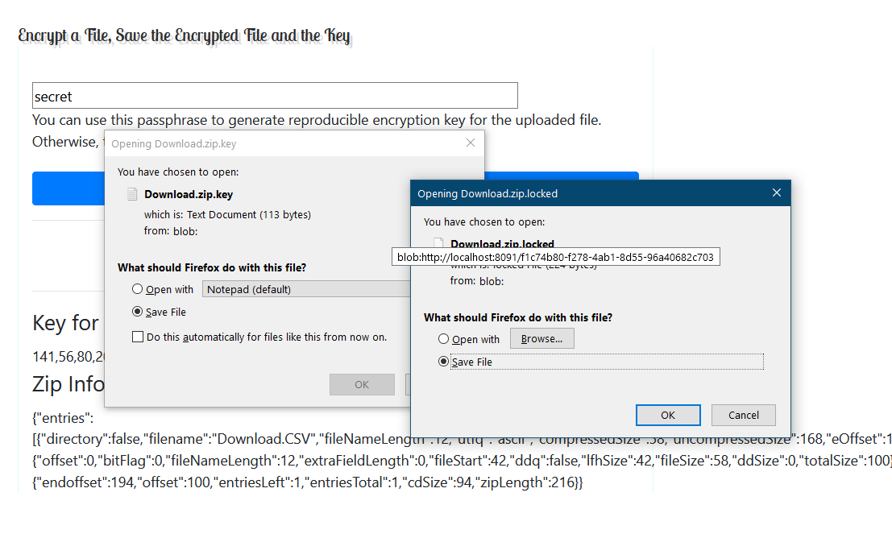

# Encryption-Schemas-with-Zip-Manipulation

A demo that shows how to do encryption in browser.

If you upload a zip file it can be manipulated in the same browser (analyzed, cleaned-up).

For any file (zip or not): the file is getting encrypted ("locked") with a generated key. The key is saved, and can be shared with someone to "un-lock" the file.

Key can be reproducible if you enter a non-empty passphrase. Otherwise, the key will be random, and will change every time.

Schema # 1:

You use a passphrase. A reproducible key is derived from the passphrase and the file name. You can share encrypted file with whoever, and share the key with trusted parties only.
The key is not easy to lose, since it's reproducible (well, assuming that the passphrase is memorable.) In short, the passphrase owner is the boss. Losing
your passphrase if you don't keep the keys may become a problem. The passphrase having been stolen may become another problem.

Pros: losing keys is not a problem.
Cons: passphrase may get stolen, and thus reveal all of the keys.

Schema # 2:

You don't use a passphrase. The key is totally random, and must be saved immediately (say, to a file). In practice, the key is uploaded to a certain place,
very different from the place to where the encrypted file goes. So, the secret is split between two locations. Once again, anybody can have the file, but only trusted 
parties get the key. This schema is more secure in the sense that knowledge of a single key (and there is nothing else to know - there is no passphrase), 
won't help you with other files, and even with the same file if it was encrypted again. You need to have both: proper version of the encrypted file and 
the proper key to decrypt. So, don't lose your keys.

Pros: no passphrase, nothing to steal.
Cons: keys may get lost.

Written in pure vanilla JavaScript.

To run:

- python3 server3.py
- go to localhost:8091 in your browser.

 
